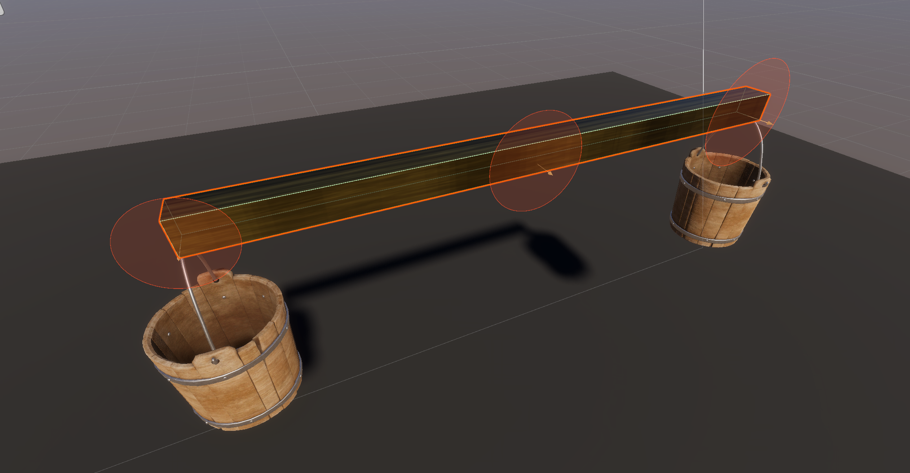
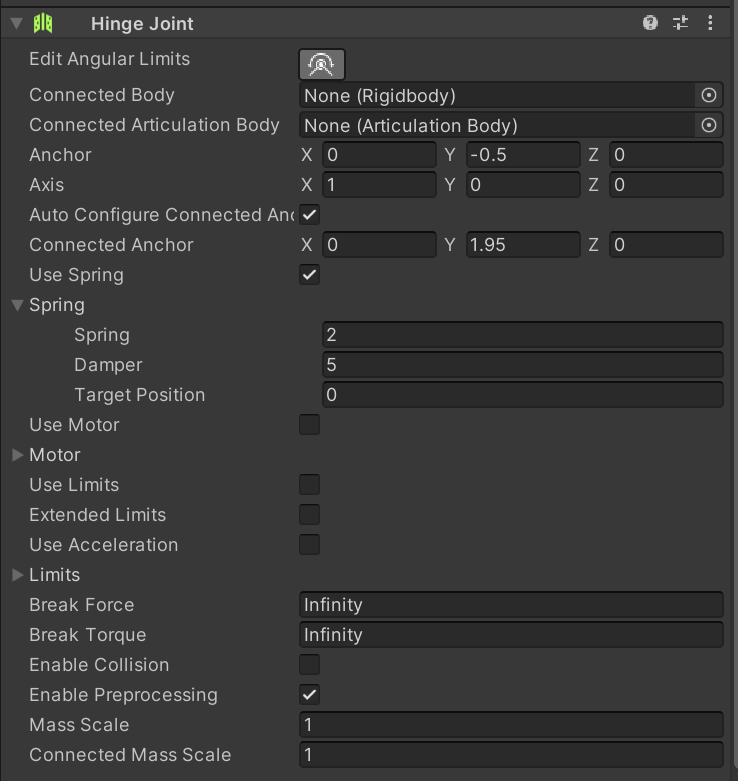
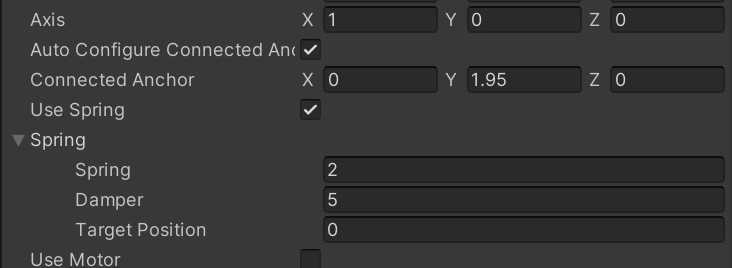
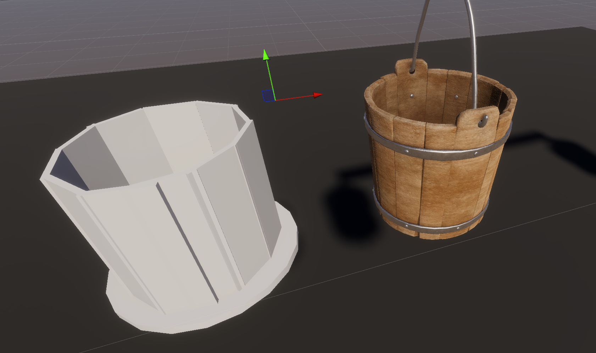
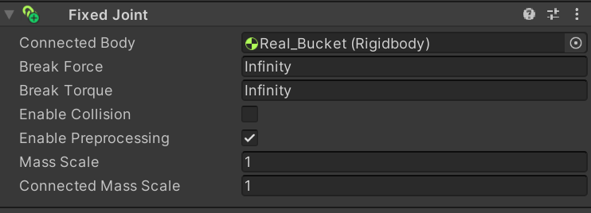
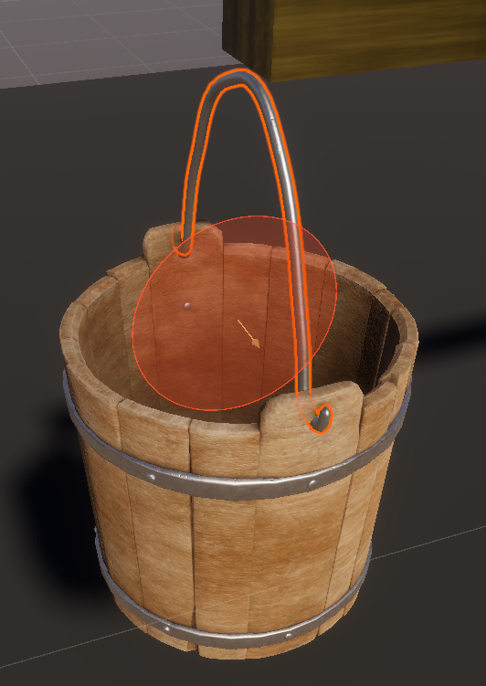
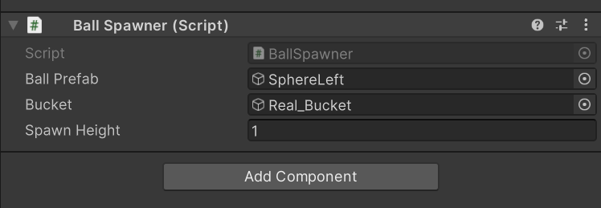
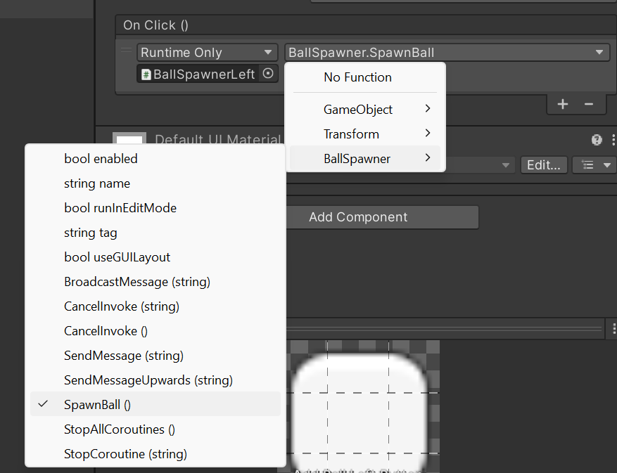

# Unity
## Arm

3 Hinge Joints

Rechts und Links sind die Henkel der Eimer Verbunden

Mittig ist ein Hingejoint mit nichts verbunden -> Fest mit Punkt in Raum verbunden

Damit sich der Arm wieder in die Ursprungslage versetzt habe ich eine Feder (Spring) genutzt. Sonst würde der Arm nicht wieder Horizontal werden, sondern in der balancierten Schräglage bleiben.

## Eimer
Textur ist ein kostenloser Prefab aus dem Asset-Store

Theoretisch könnte man mit einem Mesh-Collider den Eimer zu einem kompletten Kollisions-Objekt machen. Da das Mesh hier aber nur die Außenseite des Eimers abbildet wurde etwas "gepfuscht".

Der eigentliche Eimer sieht so aus. Ein aus Würfeln erstellter "Eimer-Collider"
Diese zusammengefasst ergeben den *Real_Bucket* in *Bucket_left* und *Bucket_right*

Damit der hässliche Eimer nicht zusehen ist habe ich den Haken bei Mesh bei allen Unterobjekten des *Real_Bucket* rausgenommen.

Damit sich der Fake-Eimer genauso wie der Unsichtbare bewegt, habe ich einen Fixed Joint auf den Fake gelegt und mit dem *Real_bucket* verknüpft.

## Henkel
Der Henkel hat 2 Hinge Joints. Einen für den richtigen und einen für den falschen Eimer. Wobei einer der beiden wahrscheinlich nutzlos ist.

Die Koordinaten für den Joint haben bei dem Henkel mit (0,0,0) schon gepasst.

## Ball
Der Ball selbst ist nichts besonderes außer dem Rigidbody. Der ermöglicht das Einstellen von Masse, Gravitation usw., sowie die Kollision in Verbindung mit dem Sphere-Collider.

(2 Bälle mit Masse = 0,5 = 1 Ball mit Masse 1)

# Alles mit Code
Die Buttons liegen auf einem Canvas.
Erstellen: 
1. Rechtscklick in Szene
2. UI/Canvas

Dann Canvas auswählen und die Kamera zuweisen.

## Skript
Input: ballPrefab, bucket, height;

bucket -> für die Position des Eimers. Ball soll immer über dem Eimer, und nicht an fester Position spawnen.

ballPrefab -> Ball (Objekt), das gespawnt werden soll.

height -> auf welcher Höhe über dem Bucket soll der Ball spawnen.

Rest ist im Skript *BallSpawner* kommentiert.

## Ball-Spawner
Leeres Objekt, was später vom Button aufgerufen wird.

Skript aus Assets auf Objekt ziehen. Anschließend Ball und Eimer (den "Physischen"!!!) zuweisen.

## Buttons
Für die Buttons wieder unter UI/Button - TextMeshPro

Die Buttons anschließend in der Szene in das Canvas ziehen.

Im Button kann dann zuerst das Objekt auf dem das Skript liegt zugewiesen werden. Dann die Funktion, die der Button ausführen soll ausgewählt werden.

